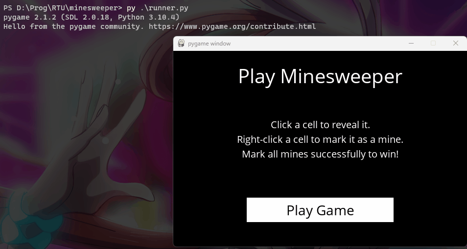

<h2 align="center"> 
  | MineSweeper using Knowledge base AI |
</h2>

[![School][school-shield]][school-url]
[![Issues][issues-shield]][issues-url]

## Overview:
This game use Pygame and knowledge base algorithm.   
You will be able to play by yourself or using the algorithm move proposition based on
previous knowledge acquired. Thus, this AI might fail to win the game if the knowledge is not enough.

## Additional Information
As it has been recommended in the course, I have used deepcopy when manipulating the knowledge base. 
No other libraries have been used and no other functions nor modifications have been made on main functions or on parameters taken.

### Branches
- `main` : contains the code for the game
- `v0.1` : contains previous commits of the game when there were still issues with the knowledge base

### Installation of required libraries

> pip install -r requirements.txt

### Launch MineSweeper

> python runner.py

### Built With

* [Python](https://www.python.org)
* [Pygame](https://www.pygame.org/news)

### Acknowledgement

> Supervised by **Prof. Aleksejs Jurenoks** (Professor at RTU)

> Project Link: [https://github.com/PhantHive/minesweeper](https://github.com/PhantHive/minesweeper/)

<!-- MARKDOWN LINKS & IMAGES -->
[issues-shield]: https://img.shields.io/github/issues/PhantHive/minesweeper.svg?style=for-the-badge
[issues-url]: https://github.com/PhantHive/minesweeper/issues/

[school-shield]: https://img.shields.io/badge/School-RTU-0B8844?&style=for-the-badge
[school-url]: https://www.rtu.lv
